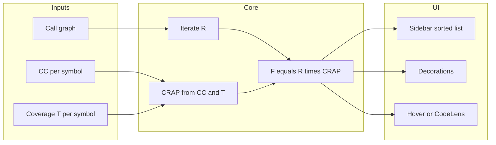

# Dependable Dependencies risk extension (VS Code)

## Paper recap (metrics you asked to implement)

From [Dependable Dependencies (Gorman, 2011)](https://codemanship.co.uk/Dependable%20Dependencies.pdf):

- **Rank (R)** — “potential impact of failure”: iterative propagation similar to PageRank **without damping**. Each unit starts at **R = 1**. Each caller **depends on** its callees; callers add to callees’ rank. If a caller has rank **R_c** and calls **k** callees, each callee receives **R_c / k** from that caller (plus the base 1 is described as accumulating from inbound contributions in the examples). Iterate until stable (or max iterations / epsilon), matching the paper’s worked examples.
- **Cyclomatic complexity (CC)** — McCabe complexity per unit (the paper’s defect proxy).
- **CRAP** (CRAP4J): **CRAP = (CC² × (1 − T)³) + CC**, with **T** ∈ [0, 1] as **fraction** of code covered by tests (paper: “percentage” as a fraction).
- **Overall risk**: **F = R × CRAP** (paper also mentions **F = R × CC** as a simpler incomplete picture; optional later toggle).

**File-level presentation (your choice):** compute **R, CC, CRAP, F** per function/method, then derive per-file scores for lists/heatmaps, e.g. **max(F)** or **sum(F)** (pick one default and document; **max** highlights worst hotspot, **sum** highlights cumulative file risk).

## Development process: strict TDD (Red → Green → Refactor)

Implementation must follow **Kent Beck–style TDD** end to end—no production logic added without a **failing automated test** written first.

- **Red:** For each behavior (starting with the smallest slice), add one **failing** test that expresses the desired outcome (the BDD scenarios below are the spec; translate them into concrete tests with fixed inputs/expected values). Run the suite and confirm **red**.
- **Green:** Write the **minimum** code to pass that test (and keep existing tests green). No speculative APIs or “while we’re here” features.
- **Refactor:** With tests green, clean up names, duplication, and structure; **re-run tests** after each refactor step.

**Practical rules for this repo**

- **Order of work:** Begin with **pure functions** (CRAP, F, rank iteration, file rollup, coverage→symbol mapping) in a **testable core package** with **no `vscode` import**; tests run under Node (e.g. **Vitest** or **Mocha**) for fast Red/Green cycles. Only after the core is driven by tests should extension host / `@vscode/test-electron` integration tests wrap thin glue.
- **LSP and UI:** Introduce **interfaces** and **fakes** (in-memory graph, fake symbol provider) so tests do not need a live language server. **Red:** test the orchestrator against the fake; **Green:** real LSP adapter implements the same interface.
- **Extension UI:** Prefer **view-models** (sort list by F, compute decoration tier from thresholds) as **pure, unit-tested** modules; Webview/sidebar code stays thin.
- **Commits / PRs (recommended):** Pair each logical change with **test-first** evidence: failing test commit or clear sequence **test → implementation** in the same PR; avoid “big bang” untested merges.

## Constraints from your answers

| Choice                                 | Implication                                                                                                                                                                                                                                                                                                                                                                                                                                                            |
| -------------------------------------- | ---------------------------------------------------------------------------------------------------------------------------------------------------------------------------------------------------------------------------------------------------------------------------------------------------------------------------------------------------------------------------------------------------------------------------------------------------------------------- |
| **Java, JS, Python**                   | No single built-in graph: use **LSP call hierarchy** (`textDocument/prepareCallHierarchy`, `callHierarchy/incomingCalls` / `outgoingCalls`) per language extension, plus **TS/JS-specific** enrichment (compiler API or `typescript-language-features`) where it yields a denser graph.                                                                                                                                                                                |
| **F = R × CRAP**                       | Must resolve **T per function**; map statement/line coverage from VS Code’s test coverage model onto symbol ranges.                                                                                                                                                                                                                                                                                                                                                    |
| **VS Code Test Coverage API**          | Subscribe to test runs / coverage providers ([Test Coverage API](https://code.visualstudio.com/api/extension-guides/testing#test-coverage)); **coverage is only available when tests are run through controllers that report `FileCoverage`**. Plan for **graceful degradation**: if no session or language doesn’t report coverage, treat **T = 0** for affected symbols (CRAP becomes worst-case) **or** mark “coverage unknown” in UI—state explicitly in settings. |
| **Function-level math, file-level UX** | Keep canonical model at **symbol** (LSP `SymbolInformation` / `DocumentSymbol` + stable id: `uri#range` or fully qualified name where available). Aggregate to file for sidebar grouping and background tint.                                                                                                                                                                                                                                                          |
| **Combo UI**                           | Sidebar (sortable), decorations (risk tiers), hover or CodeLens (breakdown).                                                                                                                                                                                                                                                                                                                                                                                           |

## Implementation strategy (phased, each phase TDD-gated)

Each phase below assumes **Red → Green → Refactor** for every new behavior; the BDD scenarios are turned into **concrete tests first**.

### Phase 1 — Extension skeleton and test harness

- **Red/Green:** Minimal extension `package.json` + activation that does nothing; add a smoke test that the extension activates (or core package test run in CI).
- Add **Node test runner** + TypeScript config for a `core/` (or `src/core/`) package tested without VS Code.

### Phase 2 — Shared core (metrics and graph math) — TDD first

- **Red:** Tests for **CRAP**, **F**, **rank iteration** on tiny hand-built graphs (golden values from paper), **file rollup** (`max(F)` or chosen default).
- **Green:** Implement pure functions until green.
- **Refactor:** Extract graph representation and iteration clarity; keep tests as regression net.

### Phase 3 — Call-graph collection — interface + fakes

- **Red:** Tests for building edges from a **fake** “symbol + outgoing calls” stream; tests for merge/dedup and stable node ids.
- **Green:** `LspCallGraphAdapter` (or per-language adapters) implementing the interface; optional **Refactor** to share TS/JS/Java/Python entry points.

**JavaScript/TypeScript:** TypeScript program / references or built-in call hierarchy where available. **Python:** Pylance call hierarchy. **Java:** Red Hat Java extension.

**Cross-language calls:** v1 separate subgraphs per language unless you scope cross-language edges explicitly.

### Phase 4 — Coverage mapping — TDD with fixtures

- **Red:** Tests that pass **synthetic** `FileCoverage`-shaped data and symbol ranges; assert **T** per function.
- **Green:** Implement mapper + settings (`fallbackT`, etc.).
- **Refactor:** Performance (index symbols by range) only with tests proving behavior unchanged.

### Phase 5 — CC acquisition — adapter TDD

- **Red:** Tests for parsing **fixture stdout/JSON** from each tool (or stub process spawn).
- **Green:** ESLint/ts-eslint, radon, Java tool wiring; cache key behavior covered by tests where observable.

### Phase 6 — UI — view-model TDD, thin VS Code glue

- **Red:** Tests for sorted risk list, decoration tier from thresholds, hover/CodeLens string from metrics DTO.
- **Green:** TreeView / decorations / providers call view-models only.
- **Refactor:** Debounce and refresh triggers without changing outputs (tests on pure scheduling helpers or integration smoke).

### Phase 7 — Integration smoke (after core is green)

- **@vscode/test-electron** (or equivalent) for one happy path: command runs, sidebar populates from **mocked** analysis service—still **test listed before** glue if possible, or smallest smoke after unit suite is strong.

## BDD-style features and scenarios

**Feature: Rank computation**

- **Scenario:** Simple star call graph  
**Given** callee **M** is called directly by six methods each with converged rank 1  
**When** rank iteration completes  
**Then** **M**’s rank matches the paper’s illustration (e.g. **1 + 6×1 = 7** after convergence rules you encode—verify against fixed test vectors extracted from the PDF examples).
- **Scenario:** Proportional split  
**Given** caller **P** has rank 4 and calls three callees and no other inbound edges  
**When** one iteration distributes rank  
**Then** each callee receives **4/3** from **P** (plus any base accumulation per your chosen formalization—lock with a golden test so UI and docs stay consistent).

**Feature: CRAP and failure risk**

- **Scenario:** CRAP with partial coverage  
**Given** a method with **CC = 4**, **T = 0.3**  
**When** CRAP is calculated  
**Then** CRAP equals **(4² × (1 − 0.3)³) + 4** (≈ **9.744 + 4**).
- **Scenario:** Risk for paper’s A/B/C-style example  
**Given** fixed **R** and **CC**, **T** for units A, B, C as in the paper  
**When** **F** is computed  
**Then** **F** matches the paper’s stated values (e.g. **F(C)** highest).

**Feature: Coverage mapping**

- **Given** a `FileCoverage` result with statement ranges  
**When** mapping to symbols  
**Then** **T** for a function equals covered statements ∩ function body / total statements in body (define branch vs statement coverage in settings).

**Feature: Sidebar risk list**

- **Given** an analyzed workspace  
**When** the user opens the DDP sidebar and sorts by **F**  
**Then** the highest-**F** symbols appear first and show file path.

**Feature: Editor decorations**

- **Given** configurable thresholds **warn** and **error**  
**When** a file’s **max(F)** exceeds **error**  
**Then** the editor shows the high-risk decoration for that file.

**Feature: Inline breakdown**

- **Given** the cursor is on a analyzed symbol  
**When** the user hovers (or reads CodeLens)  
**Then** they see **R, CC, CRAP, T, F** and a short interpretation string.

**Feature: Missing data**

- **Given** no test coverage has been reported for the workspace  
**When** analysis runs with fallback **T = 0**  
**Then** CRAP reflects no coverage and the UI indicates coverage was not loaded (or “worst-case assumption”).

**Feature: Folder-scoped analysis**

- **Scenario:** Analyze only the selected folder  
**Given** a workspace containing application code and large external dependency folders such as `node_modules`  
**When** the user runs analysis and selects a specific source folder  
**Then** symbol discovery, call-graph expansion, CC collection, coverage mapping, and UI results are limited to files rooted in that selected folder rather than the whole workspace.
- **Scenario:** Treat external modules as dependencies, not analysis targets  
**Given** code inside the selected folder imports or calls into external modules outside the selected analysis root  
**When** dependency edges are built  
**Then** those external modules are represented as boundary dependencies for dependency/rank context without recursively analyzing their internal symbols, files, or transitive dependency trees.
- **Scenario:** Exclude dependency folders by default for JavaScript projects  
**Given** a JavaScript or TypeScript workspace with `node_modules` present under the workspace root  
**When** the user runs folder-scoped analysis on their application folder  
**Then** the extension does not descend into `node_modules` unless the user explicitly selects that folder as the analysis root.

## Risks and decisions to lock during build

1. **Exact rank recurrence:** The PDF describes the idea and examples; implement **golden tests** from those examples so “R” is unambiguous (base **1** per node vs purely inbound sum—choose one rule and test it).
2. **Coverage API coverage:** Java/Python extensions may not always emit `FileCoverage` the same way as JS test runners—plan time for **per-language validation** and documented prerequisites.
3. **Analysis scope semantics:** Folder-scoped analysis needs a hard rule for what counts as “in scope”: local symbols under the selected root are fully analyzed, while references outside that root are modeled only as boundary dependencies. Lock this in tests before wiring UI.
4. **Performance:** Full-workspace call hierarchy is **O(symbols × LSP requests)**—prefer **selected-folder analysis** as the main mitigation, then add **work queue**, **caching**, **workspace trust**, and **“analyze visible files / git changes”** mode as optional settings.

## Deliverables

- Extension package in [c:\code\DDP_plugin](c:\code\DDP_plugin) with README listing **required VS Code + language extensions**, **optional CLIs** for CC, and how to run tests to populate coverage.
- **Test suite as primary spec:** fast **unit tests** for all metrics and mapping; **integration** tests for extension wiring; README documents `npm test` / `pnpm test` as the default verification loop for TDD.
- Manual checklist for Java/JS/Python smoke runs (complements automation, does not replace Red/Green on logic).
