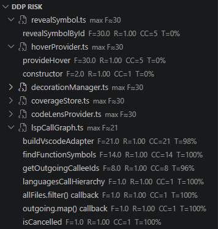

# dep-deps
Dependable Dependencies Principle as VSCode Extension

From [Dependable Dependencies (Gorman, 2011)](https://codemanship.co.uk/Dependable%20Dependencies.pdf)

[](https://github.com/reschex/dep-deps/actions/workflows/ci.yml)

## Usage

### Overview

The **Dependable Dependencies** extension analyzes your codebase to identify high-risk functions and methods based on cyclomatic complexity, test coverage, and their importance in the codebase's call graph. It computes a **failure risk (F)** score for each function to guide testing and refactoring efforts.



### Commands

Use **Shift+Ctrl+P** (or **Cmd+Shift+P** on macOS) to run these commands:

- **`DDP: Analyse Workspace`** — Analyzes all source files in the current workspace
- **`DDP: Analyse Folder...`** — Opens a dialog to select a specific folder/project to analyze
- **`DDP: Refresh`** — Re-runs analysis on the last analyzed scope

### Viewing Results

Results appear in the **DDP Risks** sidebar panel (left side in the **Explorer** view). The tree displays:

- **Files** — grouped by analyzed folder
- **Functions/Methods** — under each file, sorted by failure risk (highest first)
- **Metrics** — inline display of `CC`, `T`, `CRAP`, `R`, and `F` for each symbol

Click any function to jump to its definition in the editor. Hover over function names for detailed metric tooltips.

### Understanding the Metrics

Each function is rated using these metrics from [Dependable Dependencies (Gorman, 2011)](https://codemanship.co.uk/Dependable%20Dependencies.pdf):

| Metric | Meaning | Range | Notes |
|--------|---------|-------|-------|
| **CC** | Cyclomatic Complexity (McCabe) | 1–∞ | Counts decision branches (if, loops, etc.); higher = more complex |
| **T** | Test Coverage (fraction) | 0.0–1.0 | Percentage of function covered by tests (from LCOV data); 0 if no coverage data found |
| **CRAP** | Change Risk Anti-Pattern | 0–∞ | Formula: `CC² × (1 − T)³ + CC`; higher = riskier to change |
| **R** | Rank (call graph importance) | 1.0–∞ | PageRank-like score from the call graph; how many other functions depend on this one (directly or indirectly) |
| **F** | Failure Risk | 0–∞ | Formula: `R × CRAP`; the base risk score |
| **G** | Churn Multiplier | 1.0–∞ | Formula: `1 + ln(1 + commitCount)`; reflects how frequently the file has changed in git; G = 1 when churn is disabled |
| **F′** | Churn-Adjusted Failure Risk | 0–∞ | Formula: `F × G`; **the primary risk score when churn is enabled**; surfaces high-risk code that is also actively changing |

**Quick interpretation:**
- **High CC, low T** → High CRAP (complex code with little test coverage)
- **High T** → CRAP reduced significantly (tests make risky code safer)
- **High R + high CRAP** → High F (failures here cascade through dependents)
- **High F + frequent git commits** → High F′ (risky code that keeps changing is the most urgent to address)

### Editor Decorations

Functions are highlighted in the editor based on their `F` (failure risk) score:

- **Yellow squiggle** — Warning threshold (default F ≥ 50): moderate risk
- **Red squiggle** — Error threshold (default F ≥ 150): high risk
- **Code Lens** — Inline metrics showing `CC: X, T: Y%, CRAP: Z, R: W, F: V` (configurable on/off)

Thresholds and color intensity can be adjusted in VS Code settings (see [Configuration](#configuration)).

---

## Installation & Setup

### Prerequisites by Language

#### **TypeScript, JavaScript, JSX, TSX**

1. **ESLint** (required for cyclomatic complexity)
   ```bash
   npm install --save-dev eslint @typescript-eslint/eslint-plugin @typescript-eslint/parser
   ```
   Or if already installed globally:
   ```bash
   npm list -g eslint
   ```

2. **Test Coverage** (optional, for test coverage metric `T`)
   - Generate an **LCOV coverage file** (`coverage/lcov.info`) using Jest, Vitest, or similar
   - Run: `npm test` or `pnpm test` with coverage enabled
   - Example Jest config:
     ```json
     {
       "collectCoverage": true,
       "coverageReporters": ["lcov", "text"]
     }
     ```

#### **Python**

1. **Radon** (required for cyclomatic complexity)
   ```bash
   pip install radon
   ```
   Or with conda:
   ```bash
   conda install -c conda-forge radon
   ```

2. **Test Coverage** (optional, for test coverage metric `T`)
   - Generate an **LCOV coverage file** using `coverage` + `coverage-lcov`:
     ```bash
     pip install coverage coverage-lcov
     python -m coverage run -m pytest
     python -m coverage lcov
     ```
   - Creates `coverage/lcov.info`

#### **Java**

1. **PMD** (required for cyclomatic complexity)
   - Download from [pmd.github.io](https://pmd.github.io/latest/) (version 6+)
   - Add PMD's `bin/` directory to your `PATH`, or specify the full path in VS Code settings

2. **Test Coverage** (optional, for test coverage metric `T`)
   - **JaCoCo** is the recommended coverage provider for Java projects
   
   **Maven Setup:**
   ```xml
   <plugin>
     <groupId>org.jacoco</groupId>
     <artifactId>jacoco-maven-plugin</artifactId>
     <version>0.8.8</version>
     <executions>
       <execution>
         <goals>
           <goal>prepare-agent</goal>
           <goal>report</goal>
         </goals>
       </execution>
     </executions>
   </plugin>
   ```
   Run: `mvn clean test` — JaCoCo generates reports in `target/site/jacoco/`

   **Gradle Setup:**
   ```gradle
   plugins {
     id 'jacoco'
   }
   
   test {
     finalizedBy jacocoTestReport
   }
   
   jacocoTestReport {
     reports {
       xml.enabledByDefault = true
     }
   }
   ```
   Run: `gradle test jacocoTestReport` — JaCoCo generates reports in `build/jacoco/`

   **Convert JaCoCo to LCOV:**
   - To use JaCoCo reports with this extension, convert to LCOV format using `jacoco-to-lcov`:
     ```bash
     npm install --save-dev jacoco-to-lcov
     jacoco-to-lcov -i target/site/jacoco/jacoco.xml -o coverage/lcov.info
     ```

### Configuration

Open VS Code **Settings** (Ctrl+,) and search for `ddp` to customize analysis behavior:

#### Coverage Settings
- **`ddp.coverage.fallbackT`** (number, default: `0`)
  - Test coverage percentage to use when no LCOV data is found (0–100)
  - Set to 0 to mark uncovered code as high-risk; set to 100 to assume well-covered

- **`ddp.coverage.lcovGlob`** (string, default: `"**/coverage/lcov.info"`)
  - Glob pattern to find LCOV coverage files
  - Example: `"coverage/lcov.info"` (single file) or `"**/coverage/lcov.info"` (any depth)

#### Cyclomatic Complexity Tool Paths
- **`ddp.cc.eslintPath`** (string, default: `"eslint"`)
  - Command or path to ESLint executable (for TypeScript/JavaScript)

- **`ddp.cc.pythonPath`** (string, default: `"python"`)
  - Command or path to Python executable (Radon will be run as `python -m radon cc`)

- **`ddp.cc.pmdPath`** (string, default: `"pmd"`)
  - Command or path to PMD executable (for Java)

- **`ddp.cc.useEslintForTsJs`** (boolean, default: `true`)
  - Whether to use ESLint for TypeScript/JavaScript CC (vs. fallback RegExp estimation)

#### Rank & Risk Scoring
- **`ddp.rank.maxIterations`** (number, default: `100`)
  - Maximum iterations for PageRank convergence; increase if rank values seem unstable

- **`ddp.rank.epsilon`** (number, default: `1e-6`)
  - Convergence threshold for PageRank; smaller = more precise, slower

#### Decoration & UI
- **`ddp.decoration.warnThreshold`** (number, default: `50`)
  - Failure risk threshold for yellow highlighting (warning)

- **`ddp.decoration.errorThreshold`** (number, default: `150`)
  - Failure risk threshold for red highlighting (error)

- **`ddp.fileRollup`** (string: `"max"` or `"sum"`, default: `"max"`)
  - How to derive file-level F from function-level F:
    - `"max"` — show the single riskiest function (highlights hotspots)
    - `"sum"` — show cumulative risk (highlights overall file load)

- **`ddp.codelens.enabled`** (boolean, default: `true`)
  - Show inline code lens with metrics on each function

- **`ddp.excludeTests`** (boolean, default: `true`)
  - Exclude test files (matching `*.test.*`, `*.spec.*`, `__tests__/`, `tests/`) from analysis

#### Churn Scoring

- **`ddp.churn.enabled`** (boolean, default: `false`)
  - Weight risk scores by git commit frequency — computes `G` and `F′ = F × G` for each function
  - When enabled, the sidebar and decorations use F′ as the primary risk score; two extra sort options appear: **Sort by F′** and **Sort by G**
  - Requires the workspace to be a git repository

- **`ddp.churn.lookbackDays`** (number, default: `90`)
  - How many days of git history to count commits from (default: 90 = three months)
  - A shorter window emphasises recently active files; a longer window gives a fuller picture

---

### Example Workspace Settings

Save this in `.vscode/settings.json` to customize your workspace:

```json
{
  "ddp.coverage.fallbackT": 0,
  "ddp.coverage.lcovGlob": "**/coverage/lcov.info",
  "ddp.cc.eslintPath": "eslint",
  "ddp.cc.pythonPath": "python",
  "ddp.cc.pmdPath": "pmd",
  "ddp.cc.useEslintForTsJs": true,
  "ddp.decoration.warnThreshold": 50,
  "ddp.decoration.errorThreshold": 150,
  "ddp.fileRollup": "max",
  "ddp.codelens.enabled": true,
  "ddp.excludeTests": true,
  "ddp.churn.enabled": false,
  "ddp.churn.lookbackDays": 90
}
```

---

## Development

### Testing the Extension

To debug and test the extension locally:

1. Open the project in VS Code: `code .`
2. Open `src/extension.ts`
3. Press **F5** or go **Run → Start Debugging**
   - A new VS Code window opens with the extension loaded
4. In that window, open your project/code to analyze
5. Run **`DDP: Analyse Workspace`** or **`DDP: Analyse Folder...`** (Shift+Ctrl+P)
6. Results appear in the **DDP Risks** sidebar panel

### Running Tests

```bash
npm test          # Run unit tests
npm run test:coverage  # Generate coverage report
npm run lint      # Run ESLint
```

### Mutation Testing

For comprehensive test quality assessment, use **Stryker** mutation testing:

```bash
npm run mutation              # Full mutation test run
npm run mutation:incremental  # Faster incremental testing
```

This analyzes how well tests detect bugs by introducing mutations to source code. See [docs/testing/MUTATION_TESTING.md](docs/testing/MUTATION_TESTING.md) for detailed guidance on interpreting results and improving test effectiveness.

---

## Documentation

- **[claude.md](./claude.md)** — AI context file with high-level intent and architecture overview
- **[docs/](./docs/)** — Complete documentation organized by purpose:
  - **[architecture/](./docs/architecture/)** — Architecture decisions and system design
  - **[guides/](./docs/guides/)** — Implementation guides for CLI and GitHub Actions
  - **[development/](./docs/development/)** — Development process, TODOs, and BDD scenarios
  - **[testing/](./docs/testing/)** — Testing strategies (mutation testing, coverage analysis)

See [docs/README.md](./docs/README.md) for navigation and document purpose guide.