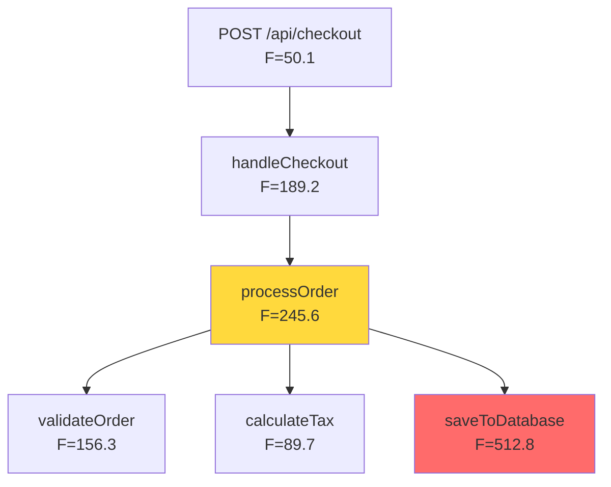

# ADR-003: Call Graph Visualization for Impact Analysis

**Status**: Proposed  
**Date**: 2026-04-28  
**Author**: System Architect  
**Context**: Enabling developers to understand the impact of changing high-risk symbols

---

## Context and Problem Statement

When DDP identifies a high-risk symbol (high F score = R × CRAP), developers need to understand:

1. **Which functions depend on this symbol?** (inbound dependencies / callers)
2. **What is the transitive impact?** (callers of callers, forming a dependency tree)
3. **What does this symbol depend on?** (outbound dependencies / callees)
4. **Where should I be cautious when changing this symbol?** (impact radius)

Currently, the call graph is computed and used to calculate PageRank (R), but:
- The edges are **discarded** after rank computation
- Users see only the **R value** (a number), not the **structure** that produced it
- There's no way to visualize **why** a symbol has high rank or **where** changes will propagate

This limits the actionability of DDP's risk scores — users know *what* is risky but not *why* or *where the risk spreads*.

---

## Decision Drivers

1. **Actionable insights**: Developers must be able to answer "If I change this, what breaks?"
2. **Multi-platform support**: Must work in both VS Code (graphical) and CLI (text-based)
3. **Performance**: Large codebases may have thousands of edges; visualization must be performant
4. **Cognitive load**: Graph visualizations can be overwhelming; must prioritize clarity over completeness
5. **Integration**: Should integrate naturally with existing DDP workflows (sidebar, commands, CLI)
6. **Hexagonal architecture**: Domain logic (graph traversal, filtering) must be infrastructure-agnostic

---

## Decision

We will implement **hierarchical call graph visualization** with the following design:

### 1. Data Model Changes

**Persist call edges in `AnalysisResult`**:

```typescript
export type AnalysisResult = {
  readonly symbols: SymbolMetrics[];
  readonly fileRollup: Map<string, number>;
  readonly edges: ReadonlyArray<CallEdge>;  // NEW: preserve edges
  readonly edgesCount: number;
};
```

**Introduce graph traversal logic in core** (infrastructure-agnostic):

```typescript
// src/core/graphTraversal.ts
export type DependencyTree = {
  readonly symbolId: string;
  readonly children: ReadonlyArray<DependencyTree>;  // callers or callees
  readonly depth: number;
  readonly isRecursive: boolean;  // cycle detection
};

export function buildCallerTree(
  symbolId: string,
  edges: ReadonlyArray<CallEdge>,
  maxDepth: number
): DependencyTree;

export function buildCalleeTree(
  symbolId: string,
  edges: ReadonlyArray<CallEdge>,
  maxDepth: number
): DependencyTree;
```

### 2. VS Code UI Components

**Command: `ddp.showCallGraph`** (context menu on symbol in DDP sidebar):

- Opens a **new tree view panel** or **webview** showing:
  - **Inbound tab**: Caller tree (who depends on this?)
  - **Outbound tab**: Callee tree (what does this depend on?)
- Each node displays:
  - Symbol name + file path
  - Risk metrics (F, R, CC) in line
  - Visual indicators for high-risk symbols (color-coded)
- **Interactive**:
  - Click to navigate to symbol definition
  - Expand/collapse tree nodes
  - Context menu to "Show call graph" for any node (recursive exploration)

**Integration with existing sidebar**:

- Add tree item context menu: "Show Call Graph" on any symbol node
- Add command palette entry: "DDP: Show Call Graph for Current Symbol"

**Alternative (lightweight MVP)**: QuickPick / Hover instead of full tree view:

- For MVP, show caller/callee list in a QuickPick menu
- Defer full tree view to iteration 2

### 3. CLI Output Format

**Command**: `ddp-cli --symbol <symbol-id> --show-graph`

**Output format** (ASCII tree):

```
Symbol: processOrder (src/orders/processor.ts#L45)
Risk: F=245.6  R=12.3  CRAP=20.0  CC=15  T=25%

CALLERS (who calls this):
└─ handleCheckout (src/checkout/handler.ts#L112) [F=189.2]
   ├─ POST /api/checkout (src/routes/checkout.ts#L25) [F=50.1]
   └─ submitOrderForm (src/ui/forms.ts#L88) [F=120.5]
      └─ onSubmit (src/ui/orderWidget.ts#L200) [F=45.0]

CALLEES (what this calls):
├─ validateOrder (src/orders/validator.ts#L34) [F=156.3]
├─ calculateTax (src/tax/calculator.ts#L67) [F=89.7]
└─ saveToDatabase (src/db/orders.ts#L101) [F=512.8] ⚠️ HIGH RISK
```

**JSON output**: `--format json` includes edges in standard format for tooling:

```json
{
  "symbol": "processOrder",
  "metrics": { "f": 245.6, "r": 12.3, "crap": 20.0, "cc": 15, "t": 0.25 },
  "callers": [
    {
      "id": "file:///src/checkout/handler.ts#L112",
      "name": "handleCheckout",
      "metrics": { "f": 189.2 },
      "callers": [ ... ]
    }
  ],
  "callees": [ ... ]
}
```

### 4. Performance Optimizations

- **Depth limiting**: Default `maxDepth=3` (configurable)
- **Lazy loading**: VS Code tree view loads children on-demand
- **Cycle detection**: Mark recursive calls, prevent infinite expansion
- **Risk-based filtering**: Option to show only high-risk paths (F > threshold)
- **Edge pre-indexing**: Build adjacency maps once per analysis:
  ```typescript
  // src/core/graphTraversal.ts
  export type EdgeIndex = {
    readonly callersByCallee: ReadonlyMap<string, string[]>;
    readonly calleesByCaller: ReadonlyMap<string, string[]>;
  };
  
  export function indexEdges(edges: ReadonlyArray<CallEdge>): EdgeIndex;
  ```

### 5. Export Formats

**Graphviz DOT export** (for external visualization with tools like Graphviz, yEd, etc.):

```bash
ddp-cli --symbol <symbol-id> --format dot > graph.dot
dot -Tpng graph.dot -o graph.png
```

**Mermaid diagram export** (for embedding in Markdown):

```bash
ddp-cli --symbol <symbol-id> --format mermaid > graph.mmd
```

Example Mermaid output:


---

## Implementation Phases

### Phase 1: Core Domain Logic (TDD)
- [ ] `graphTraversal.ts`: `indexEdges`, `buildCallerTree`, `buildCalleeTree` with cycle detection
- [ ] Persist edges in `AnalysisResult`
- [ ] Update `AnalysisOrchestrator` to include edges in result
- [ ] Tests for tree building, depth limiting, cycle detection

### Phase 2: VS Code UI (Lightweight MVP)
- [ ] Command: `ddp.showCallGraph` → QuickPick with callers/callees list
- [ ] Context menu integration in `RiskTreeProvider`
- [ ] Display symbol metrics inline

### Phase 3: CLI Output
- [ ] `--show-graph` flag for symbol-level analysis
- [ ] ASCII tree formatting
- [ ] JSON format with nested structure

### Phase 4: Advanced Visualization
- [ ] Full TreeView panel in VS Code (if QuickPick is insufficient)
- [ ] DOT/Mermaid export formats
- [ ] Risk-based filtering (show only high-F paths)
- [ ] Interactive navigation (click to explore)

---

## Consequences

### Positive
- **Better decision-making**: Developers can see impact radius before making changes
- **Faster root-cause analysis**: Trace high-risk symbols to their dependents
- **Validation of refactoring**: Verify that decoupling reduces R and F
- **Documentation**: Export graphs for architecture discussions
- **Alignment with DDP principles**: Makes "R = importance via dependency" tangible

### Negative
- **Memory overhead**: Storing edges increases `AnalysisResult` size (mitigated: edges are small `{caller, callee}` pairs)
- **Complexity**: New UI components and CLI formatting logic to maintain
- **Cognitive load**: Large graphs can overwhelm (mitigated: depth limits, filtering, lazy loading)

### Neutral
- Graph visualization is **read-only** (no refactoring actions yet) — future enhancement could add "Extract Method" or "Decouple" actions
- Requires LSP call hierarchy support (already a dependency for DDP)

---

## Alternatives Considered

### Alternative 1: No Visualization (Status Quo)
- **Pros**: No implementation cost
- **Cons**: Limited actionability of DDP insights

### Alternative 2: External Tool Integration Only
- Export edges to JSON/DOT, let users visualize in external tools (Graphviz, Neo4j, etc.)
- **Pros**: Minimal UI complexity
- **Cons**: Poor UX (context switching), no VS Code integration

### Alternative 3: Full Graph Database
- Store call graph in Neo4j or similar, query with Cypher
- **Pros**: Powerful queries (e.g., "find all paths where sum(F) > 1000")
- **Cons**: Massive complexity, operational burden, overkill for DDP's scope

### Alternative 4: Webview with Interactive Graph (D3.js, Cytoscape)
- Render full graph with pan/zoom/filter in VS Code webview
- **Pros**: Beautiful, interactive
- **Cons**: High complexity, performance issues with large graphs, may not work well in CLI

**Decision**: We chose hierarchical tree view (QuickPick → TreeView progression) because:
- Low complexity (leverages existing VS Code APIs)
- Works for both VS Code and CLI
- Focused on answering "impact analysis" questions, not general graph exploration
- Easy to extend with exports (DOT/Mermaid) for users who need full graph viz

---

## Related Decisions

- **ADR-001**: CLI Analysis Architecture — This extends CLI with `--show-graph` capability
- **ADR-002**: Language Module Extraction — Graph visualization is language-agnostic (operates on edges)

---

## References

- Dependable Dependencies Paper (Gorman, 2011): Section on R = PageRank over call graph
- VS Code Tree View API: https://code.visualstudio.com/api/extension-guides/tree-view
- Graphviz DOT format: https://graphviz.org/doc/info/lang.html
- Mermaid graph syntax: https://mermaid.js.org/syntax/flowchart.html
